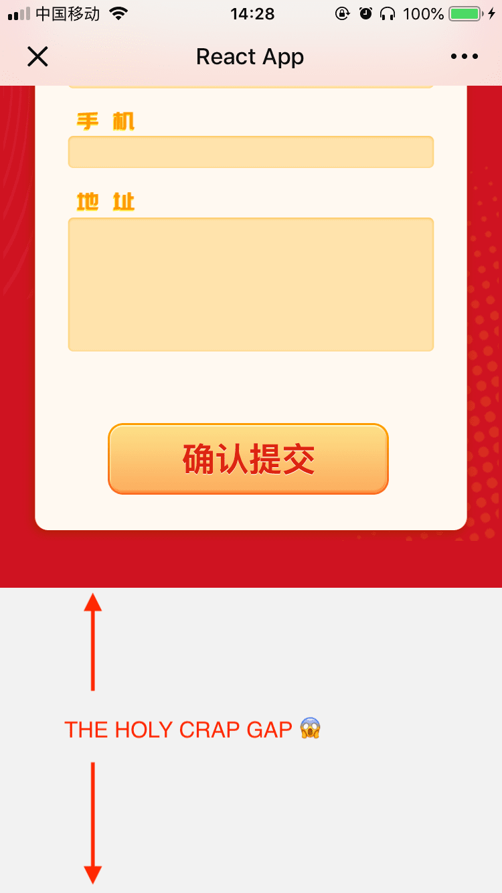

# react-robust-form-controls

create robust form controls, which never let you down on iOS 12.1+ &amp; WeChat 6.7.4+

## Problem



## Usage

simply wrap all form controls that will trigger keyboard with `robust()` provided by `<RobustFormControls />`

```
npm i -S react-robust-form-controls
```

```js
import React from 'react';
import RobustFormControls from 'react-robust-form-controls';

class App extends React.Component {
  render() {
    return (
      <div>
        <RobustFormControls>
          {robust => (
            <div>
              {robust(<input type="text" />)}
              {robust(
                <select>
                  <option value="1">pick me</option>
                  <option value="2">pick me</option>
                </select>
              )}
              {robust(<textarea />)}
            </div>
          )}
        </RobustFormControls>
      </div>
    );
  }
}
```
